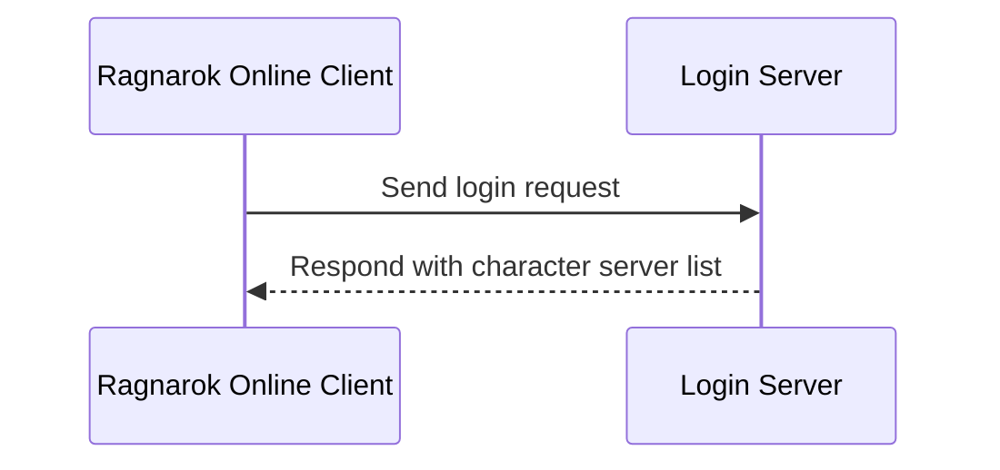

# Ragnarok Online Player Monitor / Ragnarok Online 在線人數監視器


## Overview / 專案概述

此專案為《仙境傳說》設計的玩家監控工具，透過監聽登入伺服器回傳的分流資訊，解析各伺服器的線上人數數據。目前版本採用 Wails（Go + React + TypeScript）技術堆疊開發，提供高效能且跨平台的用戶體驗。

This project is a player monitoring tool designed for Ragnarok Online. It captures and analyzes server list data from the Login Server to display the online player count for each server. The current version is built using the Wails (Go + React + TypeScript) technology stack, offering high performance and a cross-platform user experience.

## System Requirements / 系統需求

- 作業系統：支援《仙境傳說》的 64 位元 Windows 作業系統。<br>Operating System: 64-bit Windows OS capable of running Ragnarok Online.
- Npcap：需安裝以進行網路監控。下載網址：[https://npcap.com/#download](https://npcap.com/#download)。<br>Npcap: Required for network monitoring. Download at [https://npcap.com/#download](https://npcap.com/#download).
  
## Installation / 安裝說明

1. 前往 [Releases](https://github.com/SDxBacon/RagnarokOnlinePlayerMonitor/releases) 頁面。<br>Visit the [Releases](https://github.com/SDxBacon/RagnarokOnlinePlayerMonitor/releases) page.
2. 下載最新的 `.exe` 安裝檔案。<br>Download the latest `.exe` installer file.
3. 下載並安裝最新的 **Npcap** 套件。<br>Download and install the latest **Npcap** package.

## How to Use / 如何使用

1. 啟動應用程式<br>Launch the application.
2. 選擇要監控的伺服器類型（例如：台灣、韓國）<br>Select the server type to monitor (e.g., Taiwan, Korea).
3. 點擊「開始」按鈕<br>Click the "Start" button.
4. 開啟《仙境傳說》遊戲，輸入帳號和密碼登入，直到遊戲視窗顯示分流列表 <br>Open the Ragnarok Online game, log in with your account and password, and wait until the server selection list appears in the game window.
5. 返回本應用程式，程式應顯示各分流的名稱、地址與人數資訊<br>Return to this application, which should now display the name, address, and player count for each server.

## How It Works / 運作方式

以下序列圖展示《仙境傳說》客戶端與登入伺服器在登入過程中的互動。透過攔截登入伺服器回傳的封包，《監控工具》可解析出角色伺服器列表，包含每個伺服器的名稱、地址和人數。

The following sequence diagram illustrates the interaction between the Ragnarok Online Client and the Login Server during the login process.
By intercepting the packet returned by the Login Server, the Monitoring Tool can extract the character server list, including each server's name, address, and player count.



## Development Guide / 開發指南

### Technical Architecture / 技術架構

後端 (Backend)
- 語言: Go
- 框架: Wails
- 網路監控: 使用原生 Go 網路套件實現封包捕獲與分析

前端 (Frontend)
- 框架: React + TypeScript
- UI 元件: 自定義元件 + shadcn-ui

### Project Structure / 專案結構

```
/
├── app.go            # 主應用程式邏輯 / Main application logic
├── main.go           # 程式入口點 / Program entry point
├── go/               # Go 模組 / Go modules
│   ├── config/       # 配置相關代碼 / Configuration-related code
│   ├── github/       # GitHub API 相關功能 / GitHub API-related features
│   ├── network/      # 網路監控相關實現 / Network monitoring implementation
│   └── ragnarok/     # 遊戲特定邏輯 / Game-specific logic
├── frontend/         # 前端代碼 / Frontend code
│   ├── src/          # React 源代碼 / React source code
│   └── wailsjs/      # Wails 生成的前端綁定 / Wails-generated frontend bindings
└── build/            # 構建輸出目錄 / Build output directory
```

### Environment Setup / 環境設定
1. 安裝 **Go** 1.19+ / Install **Go** 1.19+
2. 安裝 **Node.js** 18+ / Install **Node.js** 18+
3. 安裝 **corepack** 與 **pnpm** / Install **corepack** and **pnpm**
   ```bash
   npm install --global corepack@latest
   corepack enable pnpm
   ```
4. 安裝 **Wails CLI** / Install **Wails CLI**:
   ```bash
   go install github.com/wailsapp/wails/v2/cmd/wails@latest
   ```

### Development Workflow / 開發流程

1. 複製專案 / Clone the repository:
   ```sh
   git clone https://github.com/SDxBacon/RagnarokOnlinePlayerMonitor.git
   ```
2. 安裝依賴 / Install dependencies:
   ```sh
   cd RagnarokOnlinePlayerMonitor/frontend
   pnpm install
   ```
3. 啟動開發服務器 / Start development server:
   ```
   wails dev
   ```
4. 構建應用 / Building the Application
   ```
   wails build
   ```

## FAQ / 常見問題
Q: 應用程式需要網路權限嗎？  
A: 是的，本應用需要網路權限才能監控伺服器狀態。  

Q: 這個工具會影響我的遊戲體驗嗎？  
A: 不會。此工具只會被動監控網路流量，不會干擾遊戲運行或修改任何遊戲檔案。  

Q: Does the application require network permissions?  
A: Yes, the application requires network permissions to monitor server status.  

Q: Will this tool affect my gameplay experience?  
A: No, this tool only passively monitors network traffic. It does not interfere with gameplay or modify any game files.
